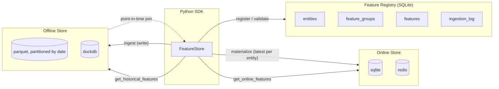

# lite-featurestore

A small, self-hosted feature store: offline store for training, online store
for low-latency serving, a feature registry for discoverability, and
point-in-time correct joins for leak-free training data. No Feast-style
complexity — opinionated, single-machine, drop-in.

## Architecture



```
featurestore/
  core/            FeatureStore SDK, config loader, pit_join (the hard part)
  stores/offline/   parquet_store.py, duckdb_store.py  (training data)
  stores/online/    sqlite_store.py, redis_store.py    (serving)
  registry/         registry.py (SQLite CRUD), validator.py, stats.py
  materialization/  offline -> online sync
  quality/          schema + null-rate/dtype checks on every ingest
  api.py            FastAPI REST layer
  cli.py            click CLI
```

## Point-in-time correct joins

The core problem: given a label observed at time T, what feature values
were *actually known* at time T — not values computed later, which would
leak the future into training data.

```
Feature history for entity 1:
  01-01 -----> tx_count_7d=1
  01-05 -----> tx_count_7d=5
  01-10 -----> tx_count_7d=9
                              label observed here (01-07)
                                       |
                                       v
  01-01 --- 01-05 === picked === . . 01-07 . . 01-10 (never picked: future)
              ^
        latest row <= label timestamp
```

Implementation (`core/pit_join.py`): `pandas.merge_asof(direction="backward")`,
grouped by entity via `by=`. `merge_asof` with `direction="backward"`
guarantees the matched feature row's timestamp is `<=` the label's timestamp
— that's the anti-leakage property, verified explicitly by
`tests/test_pit_join.py` (exact-match, before-any-data, and cross-checked
brute-force leakage assertions). The DuckDB backend expresses the same
guarantee as a SQL `SELECT DISTINCT ON (...) ... WHERE event_timestamp <=
label_timestamp ORDER BY event_timestamp DESC` query.

Multiple feature groups are joined independently against the entity
timestamps and merged into one training DataFrame, with columns namespaced
`{feature_group}__{feature_name}` to avoid collisions. Entities with zero
feature coverage before their label timestamp are collected per-group and
surfaced as a warning (`PITJoinResult.uncovered_entity_ids`).

## lite-featurestore vs Feast

| | lite-featurestore | Feast |
|---|---|---|
| Setup | `pip install`, one YAML file | Feast repo + `feast apply` + feature server |
| Offline store | parquet or DuckDB | BigQuery, Snowflake, Redshift, ... |
| Online store | SQLite (zero-dep) or Redis | Redis, DynamoDB, Datastore, ... |
| Registry | single SQLite file | protobuf registry (file/GCS/SQL) |
| PIT joins | pandas merge_asof / DuckDB SQL | Spark/BigQuery-scale point-in-time joins |
| Scale target | single machine, small-to-mid data | distributed, large orgs |
| Dependencies | pandas + pyarrow + click + FastAPI | many (protobuf, gRPC, cloud SDKs) |
| Learning curve | read one file (`pit_join.py`) | feature repo DSL, `feature_store.yaml`, providers |

Use Feast when you need distributed compute and multi-cloud providers. Use
lite-featurestore when you want a feature store that fits in an afternoon.

## Quickstart

```bash
pip install -e .          # core: parquet + sqlite, no extra deps
python examples/quickstart.py
```

```python
from featurestore import FeatureStore, FeatureGroup, Feature, Entity
import pandas as pd

fs = FeatureStore(config="featurestore.yaml")

user = Entity(name="user_id", dtype="int64", description="Platform user")
user_transactions = FeatureGroup(
    name="user_transaction_features",
    entity=user,
    features=[
        Feature("tx_count_7d", dtype="float32", description="Transaction count last 7 days"),
        Feature("tx_amount_avg_30d", dtype="float32", description="Avg transaction amount 30 days"),
    ],
    ttl_hours=24, online=True, offline=True,
    tags=["user", "transactions", "behavioral"],
)
fs.register(user_transactions)
fs.ingest(feature_group="user_transaction_features", data=computed_features_df)
features = fs.get_online_features(feature_group="user_transaction_features", entity_ids=[123, 456])
training_df = fs.get_historical_features(entity_df=labels_df, feature_groups=["user_transaction_features"])
```

## CLI

```bash
featurestore init
featurestore list
featurestore describe user_transaction_features
featurestore search transaction
featurestore ingest --group user_transaction_features --file data.csv
featurestore materialize --group user_transaction_features
featurestore stats --group user_transaction_features
featurestore validate --group user_transaction_features --file data.csv   # dry run
```

## REST API

```bash
uvicorn featurestore.api:app --reload
```

`GET /health`, `GET /feature-groups`, `GET /feature-groups/{name}`,
`POST /feature-groups`, `POST /ingest/{name}`, `POST /online-features`,
`POST /historical-features`, `POST /materialize/{name}`.

## Config (`featurestore.yaml`)

```yaml
offline_store:
  type: parquet          # parquet | duckdb
  path: ./data/offline
online_store:
  type: sqlite            # sqlite | redis
  path: ./data/online.db
  ttl_hours: 24
registry:
  type: sqlite
  path: ./data/registry.db
```

## Installing extras

```bash
pip install -e .              # core (parquet + sqlite) — required for tests/quickstart
pip install -e ".[redis]"     # + redis online store
pip install -e ".[duckdb]"    # + duckdb offline store
pip install -e ".[dev]"       # + pytest, httpx (for tests)
```

## Testing

```bash
pytest
```

`tests/test_pit_join.py` is the most important suite — it asserts, several
ways, that no feature row later than a label's timestamp can ever be
selected.

## Results

No accuracy metric applies to a feature store — the correctness claim is
the point-in-time join's anti-leakage guarantee. Verify it yourself:
`pytest` (headline suite is `tests/test_pit_join.py`, which asserts —
several ways, including a brute-force cross-check — that no feature row
later than a label's timestamp can ever be selected).

## Limitations

- No Postgres registry backend — SQLite only (spec allowed `sqlite|postgres`; a single-file store fits the "no excuse for shortcuts, but no unrequested infra" brief better for a self-hosted single-machine tool).
- `fill_strategy="last_known"` is an alias of `"none"`: `merge_asof` already returns the latest value known at-or-before the label time, so there's nothing to additionally forward-fill without looking into the future.
- Drift detection (`quality/drift_detector.py`) is a documented stub — the spec explicitly deferred this to a not-yet-built sibling project.
